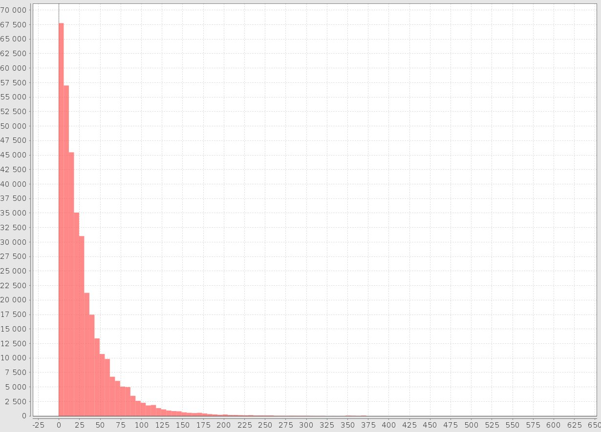

DGSArchive
==========

Barebone code to analyse the games in the Dragon Go Server (DGS) archive

This java program basically:
*  parses a single ZIP file that contains the DGS archive.
*  Processes each SGF in turn to compute some statistics
*  Can replay each game so that game positions can be analyzed (such analysis is not done yet)
*  As an example, plots the histogram/distribution of the final difference in points for games that end in scoring.

Here is the resulting distribution of scores:

Note that the DGS archive is published on the DGS web site splitted in several files, while this program
assumes that it is given as a single file. So I have also archived the original DGS archive into a single zip
file that is usable by this program and that can be downloaded here: http://talc1.loria.fr/users/cerisara/dgsArchive.tgz

